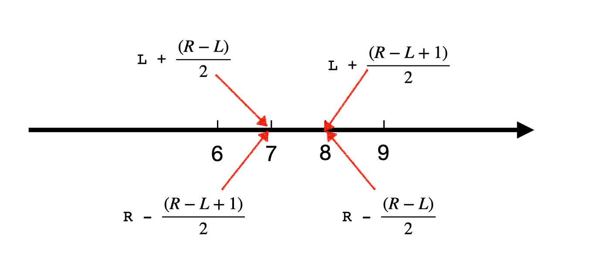

# Binary search
###https://medium.com/swlh/binary-search-find-upper-and-lower-bound-3f07867d81fb

When you are asked to find the upper or lower bound, or more precisely, 
when you need to find the maximum of the smallest value or the minimum of the largest value.

Binary Search is an algorithm to search for a target from a sorted array. It selects the middle element in the array and compares it against the target; if they are not equal, 
it eliminates one half of the array and keeps searching the other half in the same manner

